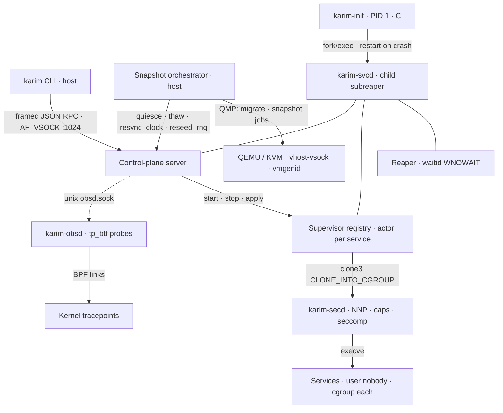
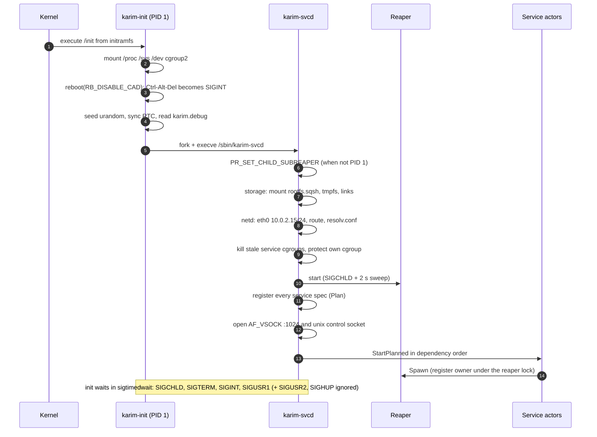

# Architecture Overview

Karim splits responsibility across a hard boundary: **the host** owns the hypervisor and all orchestration, **the guest** owns process supervision and telemetry. Two control channels cross that boundary: the AF_VSOCK control plane and the QEMU Machine Protocol (QMP). Both are structured and testable in isolation. The control plane authorizes each peer by kernel-reported identity. QMP has no authentication of its own; it is protected only by the permissions of its Unix socket. Guest network traffic crosses separately, through QEMU user-mode networking and its port forwards ([Guest Networking](/subsystems/networking)).

<TopologyDiagram />

## Design principles

1. **PID 1 never exits.** A static C init stays PID 1 for the lifetime of the guest. The Go supervisor runs as its child and is restarted when it fails, instead of turning the failure into a kernel panic. Services are in turn children of the supervisor and restart according to their `restart` policy.
2. **One owner per resource.** One reaper collects every exit status; one actor goroutine owns each service; one reader drains the eBPF ring buffer; one reader demultiplexes the QMP socket.
3. **Report observed truth.** No synthetic success and no fabricated metrics: an unattached probe reports *why*, a failed snapshot reports what was and was not undone.
4. **The kernel enforces confinement.** Path confinement uses `os.Root` (openat-based resolution), teardown uses `cgroup.kill`, identity uses UIDs and `SO_PEERCRED` — not string checks.

## Component map



## Host side

**`karim` CLI** (`cmd/karim`) is the only operator entry point. It speaks two protocols:

- *Control plane* — length-prefixed JSON frames over `vsock://CID:PORT` (default `vsock://3:1024`), or `unix://` for local testing. See the [Control-Plane API](/reference/control-plane).
- *QMP* — through the snapshot orchestrator, which drives QEMU with native QMP only (never HMP).

**QEMU** runs the guest with a read-only raw rootfs (`-drive …,format=raw,readonly=on`), `virtio-rng`, a `vmgenid` device, and `vhost-vsock-pci` (added only when `/dev/vhost-vsock` is readable and writable). With `SNAPSHOT_MODEL=internal` the Makefile also attaches a qcow2 *state node* that no guest device uses, so internal snapshots are possible without making the rootfs writable.

## Guest side

| Component | Language | Role |
|---|---|---|
| `karim-init` | C, static | PID 1: mounts, entropy seeding, RTC sync, supervisor restarts with backoff, orphan reaping, final `reboot(2)` |
| `karim-svcd` | Go, static | supervisor: reaper, registry, per-service actors, control plane, power-button watcher, network and storage bring-up |
| `karim-secd` | Go, static | pre-exec wrapper: `no_new_privs`, capability bounding set, seccomp, then `execve` of the service |
| `karim-obsd` | Go, static | eBPF loader, ring-buffer fan-out, Prometheus exporter on `:9100` |
| `karim-vsockd` | Go, static | standalone control-plane daemon for development hosts (freeze, shutdown, clock resync and RNG reseed disabled) |

### Boot sequence



The registry is filled **before** any listener opens, so the control plane can never observe a half-initialized service table.

## Trust boundaries

| Boundary | Enforcement |
|---|---|
| Host → guest control plane | privileged RPCs accepted only from VSOCK CID 2 (the host) or Unix peers running as root / the daemon's UID (`SO_PEERCRED`) |
| Guest process → control plane | Unix socket is `0600`; VSOCK loopback peers (CID 1) and TCP peers are always untrusted (read-only commands only) |
| Service → init / supervisor | services with a non-root `user` (the shipped demo workloads use `nobody`) get `EPERM` from `kill(2)` against PID 1 or the supervisor. Root is the default when `user` is omitted, and `karim-obsd` runs as root |
| Service → kernel | `karim-secd` seccomp profile and capability bounding set (see [Security](/subsystems/security) for open issues) |
| Image layer → build host | tar-layer extraction confined by `os.Root`; pinned `sha256` digests verified before extraction (unpinned layers only warn); see [open items](/subsystems/oci-layers#open-items) |

## Source layout

```text
cmd/karim            host CLI
cmd/karim-svcd       guest supervisor main
cmd/karim-secd       security launcher
cmd/karim-obsd       eBPF daemon
cmd/karim-vsockd     standalone control-plane daemon
init/init.c          PID 1 (init/*.c: sample workloads and a tiny shell)
internal/svcd        reaper.go · service.go · supervisor.go · launcher.go · cgroup.go · config.go · graph.go
internal/vsockd      transport.go · protocol.go · server.go · supervisor_provider.go
internal/pkgd        extract.go · oci.go · merger.go · layer.go
internal/builder     builder.go · cpio.go · squashfs.go · manifest.go
internal/secd        seccomp.go · capabilities.go · secd.go
internal/netd        rtnetlink interface, address, route, resolv.conf
internal/stored      SquashFS mount, tmpfs, root links, overlay helpers
internal/obsd        probe lifecycle, ring buffer, Prometheus
internal/qmp         QMP client; qmptest (record / replay)
internal/snapshot    orchestrator, contract and replay tests
internal/system      power button, filesystem freeze, RTC, RNG reseed, shutdown actions
ebpf/                probes, vmlinux.h (from kernel BTF), bpf2go bindings
config/              services/*.toml, layers.toml
kernel/              microvm_defconfig
testing/             phase harnesses 0–9, mock QMP server
docs-site/           this documentation
```
