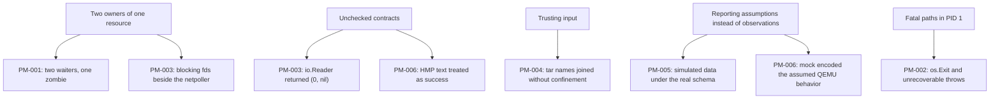

# Engineering Post-Mortems

These reports document six critical and high-severity defects that were found during a code audit of Karim MicroVM OS on **2026-09-29**, reproduced with scratch tests, and fixed. None of them is linked to a recorded production incident, so each "Impact" section describes the impact the defect *would* have had, and states how that was demonstrated.

Every report follows the same structure: summary, impact, detection, root cause, contributing factors, resolution, verification, lessons, and follow-ups that are still open.

| ID | Defect | Severity | Component | Status |
|---|---|---|---|---|
| [PM-001](/postmortems/pm-001-reaper-race) | Reaper steals exit codes; stop undone by restart policy | Critical | `internal/svcd` | Resolved |
| [PM-002](/postmortems/pm-002-pid1-panic) | PID 1 exits into a kernel panic; boot-time map race | Critical | `cmd/karim-svcd`, `init/init.c` | Resolved |
| [PM-003](/postmortems/pm-003-vsock-spin) | Every VSOCK disconnect spins a goroutine at 100 % CPU | Critical | `internal/vsockd` | Resolved |
| [PM-004](/postmortems/pm-004-oci-traversal) | OCI layer extraction writes and deletes outside the root | Critical | `internal/pkgd` | Resolved |
| [PM-005](/postmortems/pm-005-ebpf-dormant) | eBPF probes never attached; fabricated telemetry | High | `internal/obsd`, `ebpf/` | Resolved |
| [PM-006](/postmortems/pm-006-snapshots) | Snapshots report success but save nothing | High | `internal/qmp`, `internal/snapshot` | Resolved |
| [PM-007](/postmortems/pm-007-production-hardening) | Production Hardening: PID 1, VSOCK epoll, Tar-Slip, BTF, CSPRNG, SIGSYS | Critical | `init/`, `internal/` | Resolved |

## Common themes

- **One owner per resource.** Exit statuses, file descriptors, ring buffers and QMP sockets each need exactly one consumer.
- **Contracts are part of the interface.** `io.Reader`, `io.Writer` and QMP's success semantics were all broken in ways the compiler cannot see.
- **Tests must hit the real system at least once.** Three of the six defects survived passing test suites, because those suites tested mocks.

## Open follow-ups across reports

- `karim-secd` applies its policy per thread and fails open on capabilities ([Security](/subsystems/security)).
- The `app-default` seccomp profile kills BusyBox services with SIGSYS.
- `karim-obsd` is defined twice in `config/services` (`obsd.toml` and `karim-obsd.toml`).
