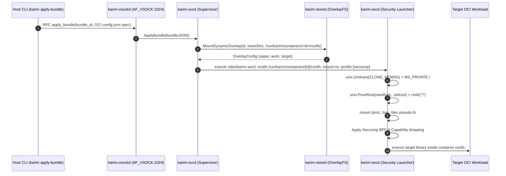

# Dynamic OCI Runtime

The **Dynamic OCI Runtime Engine** enables on-demand execution of standard OCI container bundles inside the booted MicroVM. Unlike static build-time image merging (`karim import`), dynamic bundle execution streams OCI `config.json` specs and layer rootfs trees over VSOCK, creates isolated OverlayFS mount points at arbitrary target paths (`/run/karim/containers/[id]/rootfs`), and launches processes wrapped in dedicated Mount Namespaces (`CLONE_NEWNS`) and `pivot_root` isolation.

<Callout type="note">
Dynamic OCI runtime execution combines four core subsystem layers: `secd` mount namespace isolation, `stored` dynamic OverlayFS mounting, `vsockd` RPC transport, and `svcd` process supervision.
</Callout>

## Architectural Overview



## The Four Architecture Versions

| Version | Phase | Subsystem | Responsibility |
|---|---|---|---|
| **V1** | Preparation | `internal/secd` | Unshares mount namespace (`CLONE_NEWNS`), enforces `MS_PRIVATE` propagation on `/`, executes `pivot_root(new_root, .oldroot)`, mounts container `/proc`, `/sys`, `/dev`, and detaches `.oldroot`. |
| **V2** | Storage | `internal/stored` | `MountDynamicOverlay` creates container upper/work directories under `/run/karim/containers/<id>/overlay` and mounts an OverlayFS at any arbitrary rootfs target directory. |
| **V3** | Control | `internal/vsockd` | Exposes `apply_bundle` RPC command over length-prefixed framed JSON stream transport and host CLI (`karim apply-bundle <dir/config.json> [id]`). |
| **V4** | Execution | `internal/svcd` | Parses `opencontainers/runtime-spec` JSON schema (`Spec`, `Process`, `Linux`, `Mount`), sets up dynamic storage, maps process specs to `ServiceSpec`, and manages container process lifecycle in cgroups v2. |

---

## 1. Mount Namespace & `pivot_root` Isolation (`internal/secd`)

Before invoking the container entrypoint, `karim-secd` executes filesystem isolation in kernel space:

```go title="internal/secd/secd.go (abridged)"
func PivotRoot(newRoot string) error {
	// 1. Unshare mount namespace
	if err := unix.Unshare(unix.CLONE_NEWNS); err != nil {
		return fmt.Errorf("secd: failed unsharing mount namespace: %w", err)
	}

	// 2. Prevent mounts from propagating to parent namespace
	if err := unix.Mount("", "/", "", unix.MS_REC|unix.MS_PRIVATE, ""); err != nil {
		return fmt.Errorf("secd: failed setting MS_PRIVATE: %w", err)
	}

	// 3. Bind-mount newRoot onto itself
	if err := unix.Mount(newRoot, newRoot, "", unix.MS_BIND|unix.MS_REC, ""); err != nil {
		return fmt.Errorf("secd: bind mount failed: %w", err)
	}

	// 4. Pivot root and mount container pseudo-filesystems
	putOld := filepath.Join(newRoot, ".oldroot")
	_ = os.MkdirAll(putOld, 0700)
	if err := unix.PivotRoot(newRoot, putOld); err != nil {
		return fmt.Errorf("secd: pivot_root failed: %w", err)
	}
	_ = os.Chdir("/")

	_ = unix.Mount("proc", "/proc", "proc", 0, "")
	_ = unix.Mount("sysfs", "/sys", "sysfs", 0, "")
	_ = unix.Mount("devtmpfs", "/dev", "devtmpfs", 0, "")

	_ = unix.Unmount("/.oldroot", unix.MNT_DETACH)
	_ = os.Remove("/.oldroot")
	return nil
}
```

CLI flags `-rootfs <path>` and `-mount-ns` trigger this path in `karim-secd`.

---

## 2. Dynamic OverlayFS Storage (`internal/stored`)

`MountDynamicOverlay` builds a container-specific overlay filesystem without mutating the host rootfs layout:

```go title="internal/stored/stored.go"
func MountDynamicOverlay(containerID string, lowerDirs []string, targetDir string) (*OverlayConfig, error)
```

- **Base Directory:** `/run/karim/containers/[containerID]/overlay`
- **Upper Directory:** `/run/karim/containers/[containerID]/overlay/upper`
- **Work Directory:** `/run/karim/containers/[containerID]/overlay/work`
- **Target RootFS:** `/run/karim/containers/[containerID]/rootfs`

Multiple lower directories (e.g. OCI image layers) are joined using colon delimiters (`lowerdir=/layer1:/layer2`).

---

## 3. Host-Guest Bundle Control Plane (`internal/vsockd`)

Host tooling interacts with the dynamic runtime over VSOCK:

```bash
# Apply a local OCI runtime bundle to the guest VM:
karim apply-bundle /path/to/oci-bundle my-container-id
```

The RPC frame transfers `pkgd.OCIContainerBundle`:

```json title="RPC Payload Structure"
{
  "bundle_id": "my-container-id",
  "spec": {
    "ociVersion": "1.0.2",
    "process": {
      "args": ["/bin/sh", "-c", "echo hello"],
      "env": ["PATH=/bin:/usr/bin"],
      "cwd": "/"
    },
    "linux": {
      "seccomp": { "profileName": "app-default" },
      "resources": { "memory": { "limit": 67108864 } }
    }
  }
}
```

---

## 4. OCI Runtime Spec Mapping (`internal/pkgd/oci_spec.go` & `internal/svcd/bundle.go`)

`internal/pkgd/oci_spec.go` defines Go structures mirroring `github.com/opencontainers/runtime-spec` schema definitions. `ParseAndPrepareOCIBundle` translates OCI specifications directly into `svcd.ServiceSpec` runtime models:

| OCI Spec Field (`config.json`) | `svcd.ServiceSpec` Field | Execution Effect |
|---|---|---|
| `process.args[0]` | `Exec` | Binary executable path |
| `process.args[1:]` | `Args` | Command-line arguments |
| `process.env` | `Env` | Environment variables |
| `process.cwd` | `Directory` | Working directory inside container |
| `root.path` | `RootDir` | `/run/karim/containers/[id]/rootfs` target for `pivot_root` |
| `linux.seccomp.profileName` | `SeccompProfile` | Seccomp BPF allow-list profile |
| `process.capabilities.permitted` | `CapabilitiesAdd` | Retained Linux capability bounding set |
| `linux.resources.memory.limit` | `MemoryLimit` | cgroups v2 `memory.max` byte limit |

---

## Verification

The dynamic OCI runtime suite is verified across host unit tests and MicroVM integration suites:

```bash
# Run secd pivot_root & mount namespace tests:
go test -v ./internal/secd/...

# Run stored dynamic OverlayFS tests:
go test -v ./internal/stored/...

# Run svcd OCI bundle spec parser tests:
go test -v ./internal/svcd/...

# Run host-guest VSOCK control plane tests:
go test -v ./internal/vsockd/...
```
