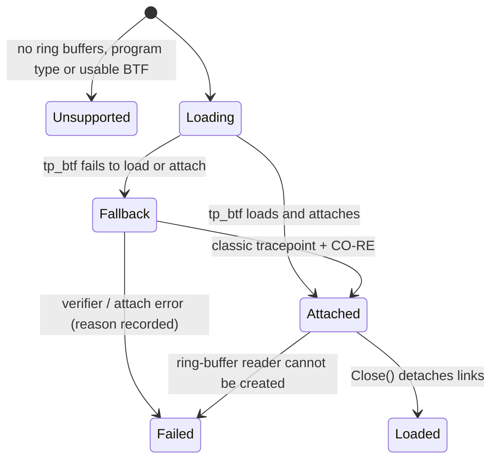
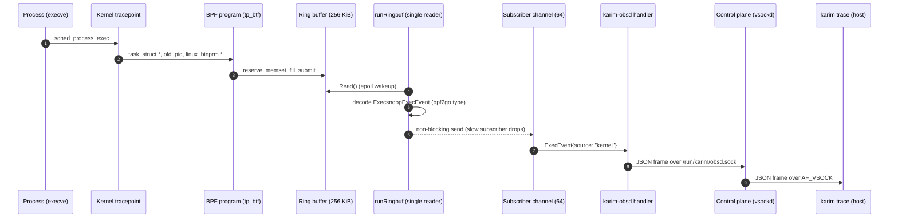
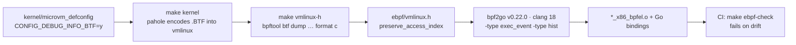

# eBPF Engine

`karim-obsd` observes the guest kernel with three probes and exposes the results over its Unix socket (proxied by the control plane for `karim obsd` and `karim trace`) and as Prometheus metrics on `:9100`.

| Probe | Tracepoints | Output |
|---|---|---|
| `execsnoop` | `sched_process_exec` | ring buffer of exec events: PID, PPID, comm, filename |
| `runqlat` | `sched_wakeup`, `sched_wakeup_new`, `sched_switch` | log2 histogram of run-queue latency (µs) |
| `biolatency` | `block_rq_issue`, `block_rq_complete` | log2 histogram of block I/O latency (µs) |

## Loading is not attaching

Loading a collection runs the verifier and creates maps. A tracepoint program **executes only once it is bound to an event** through a BPF link (or a perf event). Karim keeps every link handle for the lifetime of the probe; closing a link — or letting it be garbage-collected — detaches the program.

```go title="internal/obsd/obsd.go"
func attach(points []attachPoint) ([]link.Link, error) {
	for _, pt := range points {
		if pt.group == "" {
			l, err = link.AttachTracing(link.TracingOptions{Program: pt.prog}) // tp_btf
		} else {
			l, err = link.Tracepoint(pt.group, pt.event, pt.prog, nil)          // classic
		}
		// on error: close the links attached so far and report
	}
}
```

Teardown is the reverse: links first, then programs and maps.

## Probe lifecycle



Each probe is independent: a failure in one never downgrades the others, and partially loaded objects are closed. Feature detection uses `features.HaveMapType(RingBuf)` and `features.HaveProgramType(Tracing | TracePoint)`.

### Variant selection

1. **`tp_btf` (preferred).** BTF-enabled raw tracepoints receive typed kernel pointers — `struct task_struct *`, `struct linux_binprm *`, `struct request *` — and read fields through CO-RE relocations. Requires `/sys/kernel/btf/vmlinux`.
2. **Classic tracepoints (fallback).** Used when `tp_btf` cannot load. On kernels without in-kernel BTF, CO-RE relocations can be resolved against an external BTF file (`karim-obsd -kernel-btf`, default `/usr/lib/karim/vmlinux.btf`).

Only the programs of the chosen variant are loaded: each variant has its own `LoadAndAssign` target struct.

## Reading `__data_loc` correctly

Variable-length tracepoint fields are not stored inline. `sched_process_exec` declares `__string(filename, …)`, which becomes a 32-bit `__data_loc` descriptor: the low 16 bits are the offset of the string from the start of the record, the high 16 bits its length.

<DataLocDiagram />

```c title="ebpf/execsnoop.bpf.c (classic fallback)"
SEC("tp/sched/sched_process_exec")
int handle_exec_tp(struct trace_event_raw_sched_process_exec *ctx)
{
    struct exec_event *e = reserve_event();           /* zeroed reservation */
    if (!e)
        return 0;
    __u32 loc = BPF_CORE_READ(ctx, __data_loc_filename);
    __u16 off = loc & 0xFFFF;
    struct task_struct *task = (struct task_struct *)bpf_get_current_task();

    e->pid  = bpf_get_current_pid_tgid() >> 32;
    e->ppid = BPF_CORE_READ(task, real_parent, tgid);
    bpf_get_current_comm(&e->comm, sizeof(e->comm));
    set_filename(e, bpf_probe_read_kernel_str(&e->filename, sizeof(e->filename), (void *)ctx + off));
    bpf_ringbuf_submit(e, 0);
    return 0;
}
```

The preferred `tp_btf` program avoids the descriptor entirely: it reads `bprm->filename` and `p->real_parent->tgid` directly.

### Ring-buffer hygiene

`bpf_ringbuf_reserve` does **not** zero memory. Every record is cleared with `__builtin_memset` before use, and it carries `filename_len` plus a truncation flag, so userspace never interprets stale bytes as part of a filename.

## From tracepoint to terminal



There is **one** ring-buffer reader per daemon, fanning out to any number of `trace` sessions. Before, each session opened its own reader and the sessions silently split the events between them. Streams are context-aware and never block on a channel forever. When the host disconnects, the control plane closes its `karim-obsd` connection, and `karim-obsd` notices when its next frame write fails. On an idle system that happens at the next exec event, so a subscriber can outlive its client until then.

Captured in the MicroVM while starting `sample_app`:

```text
TIME           PID   PPID   COMM         FILENAME
17:35:02.449   149   60     karim-secd   /sbin/karim-secd
17:35:02.454   149   60     sample_app   /bin/sample_app
```

PID 149 is exec'd first as the isolation wrapper, then replaces itself with the service; PID 60 is the supervisor.

## Histograms and metrics

Slot *i* counts latencies in [2<sup>i</sup>, 2<sup>i+1</sup>) µs (slot 0 also holds 0 and 1); the last of 20 slots is open-ended. The kernel also accumulates the exact `sum_us` and `count`.

```c title="ebpf/karim_bpf.h"
struct hist {
    __u64 slots[KARIM_MAX_SLOTS];   /* 20 */
    __u64 sum_us;
    __u64 count;
};
```

Prometheus buckets therefore use the slot's **upper** edge, `le = 2^(i+1)`, and `_sum` is the measured sum. `_count` is the sum of the slot counts. The `:9100` endpoint listens on all guest interfaces without authentication; it is not forwarded to the host by default. The shape of the output (values illustrative):

```text
karim_obsd_probe_up{probe="runqlat",variant="tp_btf",state="attached"} 1
karim_obsd_runq_latency_microseconds_bucket{source="kernel",le="2"} 490
karim_obsd_runq_latency_microseconds_sum{source="kernel"} 1873
```

### Honest degradation

- A probe that is not attached exports `karim_obsd_probe_up{probe,variant,state} 0` and **no** histogram series. The reason is not a metric label; `karim obsd` shows it, and the JSON `probes` array carries it.
- `karim obsd` prints `ACTIVE`, `DEGRADED (some probes are not attached)` or `SIMULATION MODE` in its header, and marks probes with read errors as `[N read errors]`.
- A failed map read increments `karim_obsd_probe_errors_total` and returns an error, never substitute numbers.
- Synthetic data exists only behind `karim-obsd -simulate` (development and host-side tests). It is labelled `source="simulated"`, and `karim obsd` prints `SIMULATION MODE`.

## The CO-RE build pipeline



- **BTF is produced by the kernel build.** `pahole -J` encodes DWARF into `.BTF` while linking `vmlinux`; there is no separate step.
- **`vmlinux.h` comes from that BTF** via `bpftool btf dump file vmlinux format c`. It wraps every struct and union (`apply_to = record`) in `#pragma clang attribute push (__attribute__((preserve_access_index)))`, so clang emits relocation records and the loader patches field offsets against the running kernel.
- **Shared types** live in `ebpf/karim_bpf.h` with `KARIM_`-prefixed constants: a real `vmlinux.h` already defines enumerators such as `TASK_COMM_LEN`.
- **Go decoding types are generated** from BTF (`bpf2go -type`), e.g. `ExecsnoopExecEvent`, `RunqlatHist`, so they cannot drift from the C layout.
- **Renamed fields** use CO-RE existence checks: `task_struct->__state` was `->state` before Linux 5.14.

<Callout type="success" title="Verified">
In the MicroVM all three probes report `attached (tp_btf)`, the run-queue histogram fills with real data, and `karim trace` shows real filenames and parent PIDs.
</Callout>
