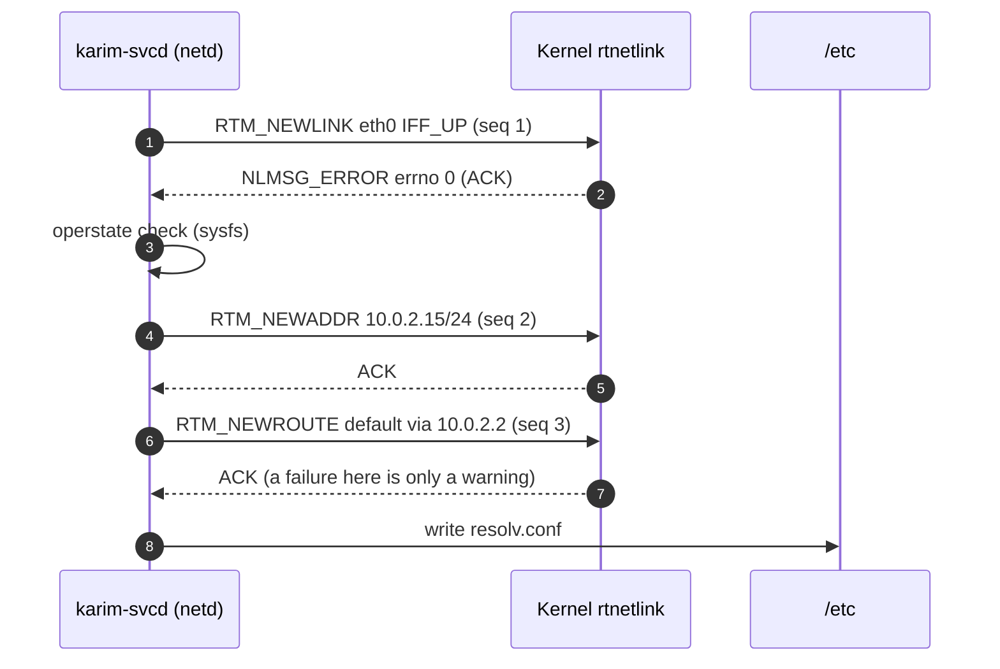

# Guest Networking

`internal/netd` gives the guest its IPv4 configuration at boot. It has no DHCP client and does not shell out to `ip`. Instead it sends three rtnetlink requests from Go, waits for each acknowledgement, and writes `/etc/resolv.conf`. It runs inside `karim-svcd` as boot step 2, after storage and before cgroups and services. Disable it with `karim-svcd -enable-net=false`.

<NetworkDiagram />

## The static configuration

The MicroVM boots with QEMU user-mode networking (`-netdev user`, a.k.a. slirp). Slirp always places the guest on the same virtual subnet, so the configuration is fixed and needs no discovery:

| Setting | Value | Source |
|---|---|---|
| Interface | `eth0` (virtio-net-pci) | `netd.DefaultConfig("eth0")` |
| Address | `10.0.2.15/24` | slirp's first guest address |
| Default gateway | `10.0.2.2` | slirp's virtual router (NATs to the host uplink) |
| DNS | `10.0.2.3`, then `1.1.1.1` | slirp's DNS forwarder, public fallback |

```go title="internal/netd/netd.go"
func DefaultConfig(ifaceName string) NetworkConfig {
	return NetworkConfig{
		InterfaceName: ifaceName,       // "eth0" when empty
		IPAddress:     "10.0.2.15",
		NetmaskCIDR:   24,
		GatewayIP:     "10.0.2.2",
		DNSServers:    []string{"10.0.2.3", "1.1.1.1"},
	}
}
```

<Callout type="note" title="Different network backend?">
The values are right only for slirp. With a tap/bridge backend or another subnet, `NetworkConfig` has to be filled differently: `karim-svcd` currently always passes `DefaultConfig`, and neither the kernel command line nor a config file overrides it.
</Callout>

## Bring-up sequence

`AutoConfigure` runs four steps in order. How a failure is handled differs by step:

| Step | Request | On failure |
|---|---|---|
| 1. Link up | `RTM_NEWLINK`, `ifi_flags = ifi_change = IFF_UP` | **aborts** the remaining steps |
| 2. Address | `RTM_NEWADDR` with `IFA_LOCAL` and `IFA_ADDRESS`, `NLM_F_CREATE \| NLM_F_REPLACE` | **aborts** the remaining steps |
| 3. Default route | `RTM_NEWROUTE` 0.0.0.0/0, `RTA_GATEWAY` + `RTA_OIF`, table main, `RTPROT_BOOT` | logs a warning, continues |
| 4. Resolver | writes `/etc/resolv.conf` (`# Generated by karim-netd`) | logs a warning, continues |

`NLM_F_REPLACE` on the address and route makes the steps **idempotent**: when a crashed supervisor is restarted by init, it runs netd again, and the second run replaces the existing entries instead of failing with `EEXIST`.

After the link request the kernel's acknowledgement is not taken on trust. `VerifyInterfaceUp` also reads `/sys/class/net/eth0/operstate` and accepts `up`, `unknown` or `lowerup`. If the sysfs file is unreadable, the check passes.



## Netlink on the netpoller

Each request uses its own `AF_NETLINK / NETLINK_ROUTE` socket. It is created `SOCK_NONBLOCK | SOCK_CLOEXEC` and wrapped in an `*os.File`, the same pattern as the [VSOCK transport](/subsystems/vsock-transport). The acknowledgement wait therefore parks the goroutine on epoll and never blocks an OS thread, and a 2-second read deadline bounds it:

```go title="internal/netd/netd.go" {7-9}
func readNetlinkAckPersistent(file *os.File, expectedSeq uint32, timeout time.Duration) error {
	file.SetReadDeadline(time.Now().Add(timeout))
	rawConn, _ := file.SyscallConn()
	for {
		err := rawConn.Read(func(fd uintptr) bool {
			n, _, recvErr = unix.Recvfrom(int(fd), rb, 0)
			// EAGAIN: return false and park on the poller until readable
			return recvErr != unix.EAGAIN && recvErr != unix.EWOULDBLOCK
		})
		// parse; skip messages whose seq != expectedSeq;
		// NLMSG_ERROR with errno 0 is the ACK, anything else is the error
	}
}
```

The code matches replies to requests by sequence number, which is fixed per request type (1, 2, 3), and ignores other messages. A negative errno in `NLMSG_ERROR` is returned as a `unix.Errno`, so the log shows messages like `netlink error: file exists`.

## Reaching guest services

QEMU forwards two host ports into the guest (`make run`):

| Host | Guest | Typical listener |
|---|---|---|
| `localhost:8080` | `10.0.2.15:8080` | the `httpd` sample service |
| `localhost:8000` | `10.0.2.15:80` | an imported web-server layer (for example nginx) |

```bash
curl http://localhost:8080/
```

Other guest ports aren't reachable from the host. That includes `kv_store` on `:6379` and the `karim-obsd` metrics on `:9100`. Read metrics through the control plane (`karim obsd`, `karim metrics`), or add a `hostfwd` rule to `QEMU_ARGS` in the Makefile.

<Callout type="open" title="Known gaps">
- **Loopback is never brought up.** netd configures only `eth0`, and nothing else in the boot path sets `lo` up, so services cannot reach each other on `127.0.0.1`. They can still connect to `10.0.2.15`.
- **IPv4 only.** There is no IPv6 address or route.
- **No link-state monitoring.** Configuration happens once at boot.
</Callout>

## Tests

`internal/netd/netd_test.go` covers `DefaultConfig` and `WriteResolvConf` against a temporary directory. The netlink paths need `CAP_NET_ADMIN` and a real interface, so they are exercised in the booted MicroVM. `make test-phase2` runs the netd and stored suites together.
