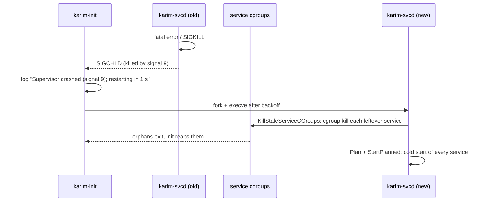
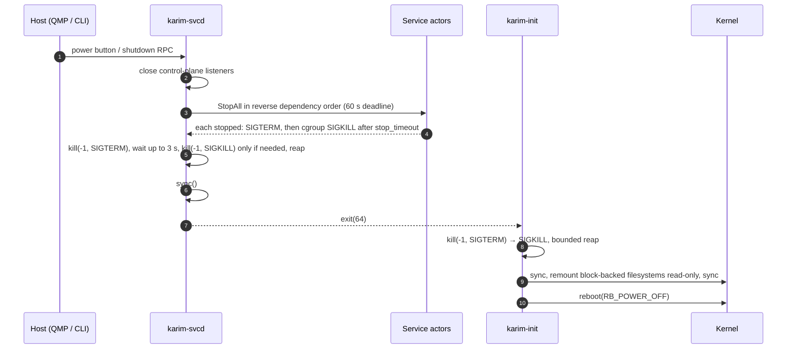

# PID 1 & Lifecycle Contract

When the init process of the initial PID namespace exits — for *any* reason: `os.Exit`, an unrecovered panic, a Go runtime fatal error — the kernel calls `panic("Attempted to kill init!")`. With `panic=0` on the command line the VM then hangs forever. Karim's lifecycle is built around one contract: **PID 1 never exits; the only legitimate end is `reboot(2)`.**

## Two processes, two jobs

## Two processes, two jobs

| | `karim-init` (C) | `karim-svcd` (Go) |
|---|---|---|
| PID | 1, forever | child of init |
| Scope | minimal and auditable | everything complex |
| On crash | — (cannot crash into a panic) | init reaps reparented zombies and restarts svcd with backoff |
| Reaping | orphans reparented to PID 1 (`waitpid(-1, &status, WNOHANG)`) | its own subtree (`PR_SET_CHILD_SUBREAPER`) |
| Final step | kill remaining, sync, remount ro, `reboot(2)` | drain services, report action via exit code (64, 65, 66) |

Moving the supervisor out of PID 1 converts a Go fatal error — which `recover` cannot intercept, e.g. `concurrent map read and map write` — from a kernel panic into a supervised restart.

## Init's event loop

Init handles child process termination using a dedicated `sigaction` signal handler (`SA_NOCLDSTOP | SA_RESTART`) for `SIGCHLD` running a non-blocking `waitpid(-1, &status, WNOHANG)` loop to reap reparented orphan processes without blocking the init thread. Unprivileged signals to PID 1 (`SIGUSR1`, `SIGUSR2`) are explicitly masked or safely ignored.

```c title="init/init.c"
static void setup_signals(void) {
    struct sigaction sa;
    memset(&sa, 0, sizeof(sa));
    sa.sa_handler = sigchld_handler;
    sa.sa_flags = SA_NOCLDSTOP | SA_RESTART;
    sigemptyset(&sa.sa_mask);
    sigaction(SIGCHLD, &sa, NULL);

    struct sigaction sa_ign;
    memset(&sa_ign, 0, sizeof(sa_ign));
    sa_ign.sa_handler = SIG_IGN;
    sigaction(SIGUSR1, &sa_ign, NULL);
    sigaction(SIGUSR2, &sa_ign, NULL);
}
```

At boot init calls `reboot(RB_DISABLE_CAD)`, so Ctrl-Alt-Del arrives as `SIGINT` — a graceful request — instead of an immediate hard reset.

### Exit-code contract

The supervisor tells init *why* it exited:

| Exit code | Meaning | Init does |
|---|---|---|
| 64 | poweroff completed | finalize, `reboot(RB_POWER_OFF)` |
| 65 | reboot completed | finalize, `reboot(RB_AUTOBOOT)` |
| 66 | halt completed | finalize, `reboot(RB_HALT_SYSTEM)` |
| 0 | clean service exit | log clean termination; reset run trackers |
| anything else, or a signal | crash | clean up orphan processes, restart `karim-svcd` after backoff (1 s → 30 s) |

If init itself was signalled to shut down and the supervisor does not finish within 90 s, init finalizes anyway. That deadline does not cover a shutdown the supervisor starts on its own (power button or RPC), because init only learns about that from the exit code. If the supervisor crashes in the middle of such a drain, init restarts it.

## Crash recovery



Services orphaned by the crash are reparented to init; the new supervisor kills them through their cgroups and starts a clean generation. This was exercised end to end: a root service `SIGKILL`ed the supervisor, init restarted it, and the stale `httpd`, `kv_store` and `karim-obsd` processes were terminated and cold-started.

## Graceful shutdown

Three triggers converge on one drain path in the supervisor:

- the **ACPI power button** — QMP `system_powerdown`, read from the evdev node whose name is "Power Button" (`EV_KEY` / `KEY_POWER`, value 1);
- the privileged **`shutdown` RPC**, accepted only from trusted peers (host CID 2, or a local root/same-uid Unix peer) (`karim shutdown [poweroff|reboot|halt]`);
- **signals forwarded by init**: init passes SIGTERM, SIGINT and SIGUSR1 on to the supervisor unchanged.



Actual console output from the end-to-end run:

```text
[karim-svcd] Shutdown requested: poweroff
[karim-svcd] Shutdown sequence (poweroff): stopping services in reverse dependency order...
[karim-svcd] Stopping service kv_store (PID 254) with SIGTERM...
[karim-svcd] Service kv_store stopped (killed by signal 15 (terminated))
[karim-svcd] Stopping service httpd (PID 245) with SIGTERM...
[karim-svcd] Services stopped; handing poweroff to init.
[karim-init] Final shutdown (poweroff): terminating remaining processes...
[karim-init] System poweroff.
[   37.863379] reboot: Power down
```

`kv_store` (`after = ["httpd"]`) stops before `httpd` — reverse dependency order.

<Callout type="design" title="The kill(-1) guard">
`kill(-1, sig)` signals every process the caller may signal except PID 1 and itself. The supervisor only broadcasts it when it is PID 1 or init's direct child; run from a shell on a development host it skips the broadcast rather than signalling the whole machine.
</Callout>

## Other boot paths

- **Debug shell.** With `karim.debug=1` or `karim.debug=shell` on the kernel command line, init runs `/bin/sh` on the console **before** it starts the supervisor, and waits for the shell to exit. Shutdown signals that arrive in the meantime are consumed and discarded.
- **Missing supervisor.** If `/sbin/karim-svcd` does not exist, init falls back to a console shell and keeps reaping orphans. An `execve` failure exits the child with 127, which init treats as a crash.
- **Supervisor as PID 1.** When `karim-svcd` is started as PID 1 (without karim-init), it remounts filesystems read-only and calls `reboot(2)` itself.

The supervisor accepts `-config-dir` (default `/etc/karim/services`), `-enable-net`, `-enable-overlay`, `-enable-vsockd` and `-emergency-shell`, all enabled by default. The local control socket is `/run/karim/vsock.sock`, which `KARIM_UNIX_SOCKET` overrides.

## Protecting the supervisor

- `oom_score_adj = -1000` and a dedicated cgroup `karim-supervisor` with `memory.min = 32 MiB`.
- A soft Go memory limit of 96 MiB unless `GOMEMLIMIT` is set.
- Panic recovery around every control-plane handler (panics become error responses; runtime throws are covered by process separation).
- The registry is filled before listeners open, and every map access is behind the registry's methods.

<Callout type="open" title="Known gap">
Only the supervisor watches the power button, so a press that arrives while init is restarting a crashed supervisor is lost. Signals to init still work during that window, but init then finalizes **immediately**: remaining processes are killed with `kill(-1)` and services are not drained in dependency order.
</Callout>
