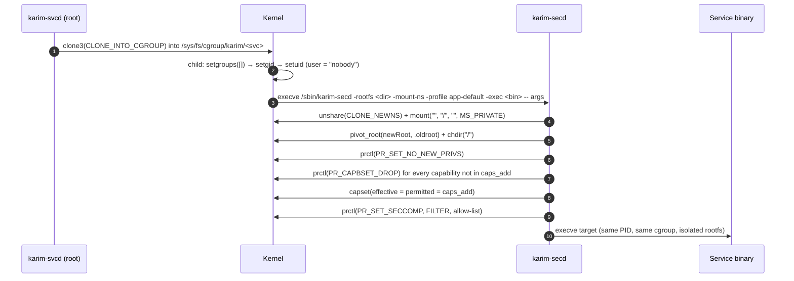

# Security & Isolation

Isolation in Karim is layered. Each layer is described with its **current** status — what is enforced today, and which known defects remain open — because a security model is only as useful as it is accurate.

| Layer | Mechanism | Status |
|---|---|---|
| Service identity | `user` / `group` → `syscall.Credential` | Enforced |
| Signal boundary | UID separation: services with a non-root `user` cannot `kill(2)` init or the supervisor | Enforced for non-root services, verified in a VM |
| Mount isolation | Mount Namespace (`CLONE_NEWNS`) + `pivot_root` in `karim-secd` | Enforced when `-rootfs` is set |
| Control-plane access | `0600` socket, `SO_PEERCRED`, VSOCK CID 2 only for privileged commands | Enforced |
| Resource limits | cgroup v2 `memory.max`, `cpu.max`, `CLONE_INTO_CGROUP` | Enforced, best effort (a failed limit write or cgroup creation is logged; the service still starts) |
| Syscall filter | `karim-secd` seccomp-BPF allow-lists | Enforced, with open profile gaps |
| Capabilities | bounding set + `capset` in `karim-secd` | **Open defects** |
| Thread consistency of the policy | `runtime.LockOSThread` / `SECCOMP_FILTER_FLAG_TSYNC` | **Open — not yet implemented** |

## The launch path



`karim-secd` is skipped entirely when `seccomp_profile` is exactly `unrestricted`, `none` or `disabled` (case-sensitive), or when no secd binary is found. secd itself lower-cases the profile name, so `"Unrestricted"` does run secd, with an allow-all filter but with capabilities dropped. When `-rootfs` is provided, `karim-secd` performs `pivot_root` into the container rootfs before applying seccomp filters.

## Identity and the signal boundary

`kill(2)` succeeds only if the sender's real or effective UID matches the target's real or saved UID, or the sender holds `CAP_KILL`. Running services as `nobody` therefore makes init and the supervisor unaddressable, independent of any seccomp profile. The shipped demo services use it:

```toml title="config/services/kv_store.toml (abridged)"
name = "kv_store"
exec = "/bin/kv_store"
restart = "always"
user = "nobody"
seccomp_profile = "net-service"
memory_limit = "16M"
cpu_quota = "25%"
after = ["httpd"]
```

Verified in the MicroVM with a hostile service running as `nobody`:

```text
[karim-svcd | attacker | ERR] sh: can't kill pid 1: Operation not permitted
[karim-svcd | attacker | ERR] sh: can't kill pid 59: Operation not permitted
```

A service running as root (the default when `user` is omitted) *can* signal init. The kernel drops signals to init only when their disposition is `SIG_DFL`. Init instead *blocks* SIGTERM, SIGINT and SIGUSR1 and consumes them synchronously with `sigtimedwait` as shutdown requests, so a root service can power the VM off.

## Control-plane authorization

Peer identity comes from the kernel, never from the request:

| Transport | Identity source | Trusted when |
|---|---|---|
| AF_VSOCK | accepted peer address | `CID == 2` (`VMADDR_CID_HOST`) |
| Unix socket | `SO_PEERCRED` | `uid == 0` or `uid == daemon euid` |
| anything else | — | never |

Privileged commands need a trusted peer. They are `start_service`/`start`, `stop_service`/`stop`, `load_service`/`apply_service`/`run_service`, `quiesce`/`freeze`, `unquiesce`/`thaw`, `shutdown`, `resync_clock` and `reseed_rng`. Every other command is allowed for any peer that can connect: `ping`, `list_services`/`ps`, `get_logs`/`logs`, `get_metrics`/`metrics`, `get_obsd`/`obsd`, `get_system_status`/`system`/`status`, and the `trace`/`execsnoop` stream. This means any guest process can open an exec trace. Guest processes reaching the server over VSOCK loopback (CID 1) are read-only. Service names are validated (`^[A-Za-z0-9][A-Za-z0-9_.-]{0,63}$`, no `..`) because they become file names and cgroup paths.

## Seccomp profiles

Filters are allow-lists compiled to classic BPF: load `seccomp_data.arch`, kill on anything but `AUDIT_ARCH_X86_64`, compare `nr` against the list, `SECCOMP_RET_KILL_PROCESS` by default.

| Profile | Contents | Status |
|---|---|---|
| `unrestricted` | allow all (secd skipped) | usable |
| `app-default` | ~110 syscalls including networking | **gaps**: no `getdents64`, `statx`, `kill`, `restart_syscall`, … |
| `net-service` | identical to `app-default` | usable for the C demo servers |
| `strict` | ~20 syscalls, **no `execve`** | unusable: secd is killed at exec |

<Callout type="design" title="Graceful SIGSYS Exception Handling">
When a seccomp BPF filter violation occurs, `karim-secd` catches `SIGSYS` (Signal 31) using `SetupSIGSYSHandler()`, logging structured violation telemetry (`[karim-secd | SECURITY WARNING] SIGSYS signal 31 received: blocked by Seccomp BPF policy!`) and exiting cleanly (code 159) rather than suffering silent kernel process crashes.
</Callout>

## Open defects in `karim-secd`

These were identified in the audit and are **not** part of the six fixes documented under [Post-Mortems](/postmortems). They are listed with the intended remediation.

### 1. The policy is applied per thread

`PR_SET_NO_NEW_PRIVS`, `PR_CAPBSET_DROP`, `capset(2)` and `PR_SET_SECCOMP` (without TSYNC) all act on the **calling thread**. `karim-secd` is a Go program whose main goroutine can migrate between OS threads after any syscall, and `execve` inherits the credentials and filter of *the thread that calls it*. A probe that set `NoNewPrivs` once and then sampled `/proc/thread-self/status` from the same goroutine saw `NoNewPrivs: 0` in 1423 of 2000 checks.

```go title="planned fix (not in the tree yet)"
func init() {
	// Keep main on the thread that applies the policy and calls execve.
	runtime.LockOSThread()
}

// And install the filter process-wide rather than per thread:
//   seccomp(SECCOMP_SET_MODE_FILTER, SECCOMP_FILTER_FLAG_TSYNC, &prog)
```

### 2. Capability dropping fails open

- `EnforceSecurityPolicy` ignores errors from `DropCapabilityBoundingSet` and `DropCapabilities`.
- An unknown name in `capabilities_add` makes `DropCapabilities` return **before** `capset`, so the effective and permitted sets are not reduced. Only the bounding-set drop limits what the target keeps after `execve`, and that drop silently skips unknown names and acts per thread (defect 1).
- `ApplySeccompFilter` always sets `PR_SET_NO_NEW_PRIVS`, so `no_new_privs = false` has no effect for any profile that installs a filter.
- For a service with a non-root `user`, `capabilities_add` cannot work. `capset` cannot raise capabilities after `setuid`, no ambient capabilities are set, and the error is ignored. `["ALL"]` keeps every capability.
- `capabilities_drop` is never consulted: any drop list behaves like "drop everything except `capabilities_add`".
- With `seccomp_profile = "unrestricted"` the wrapper is skipped, so capability settings are silently ignored. `config/services/obsd.toml` is an example: its `capabilities_add = ["CAP_SYS_ADMIN", "CAP_BPF", "CAP_PERFMON"]` has no effect, and the daemon keeps full root.
- If `/sbin/karim-secd` is missing, services start unconfined without a warning.

Remediation: treat every enforcement error as fatal, validate capability names at config parse time, apply capabilities independently of the seccomp profile, and refuse to start a service whose requested isolation cannot be applied.

### 3. Profile coverage

Derive allow-lists from the actual syscall usage of the static glibc/BusyBox userland (for example by tracing with `strace -f -c` under representative workloads), add `restart_syscall` to every profile, and give `strict` the syscalls needed to reach `execve`.
