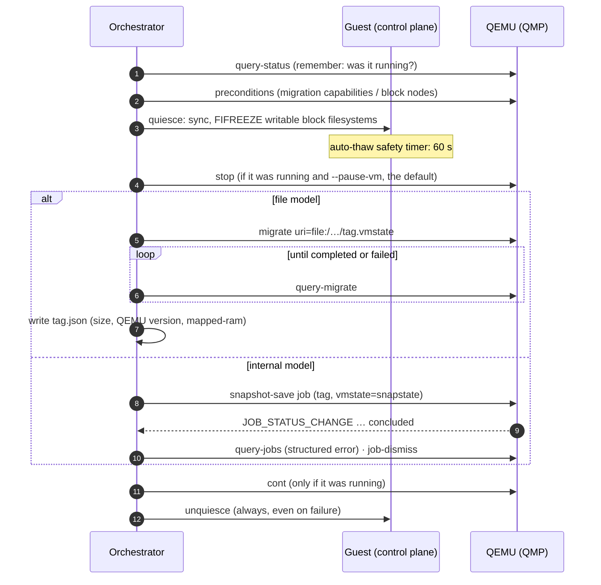
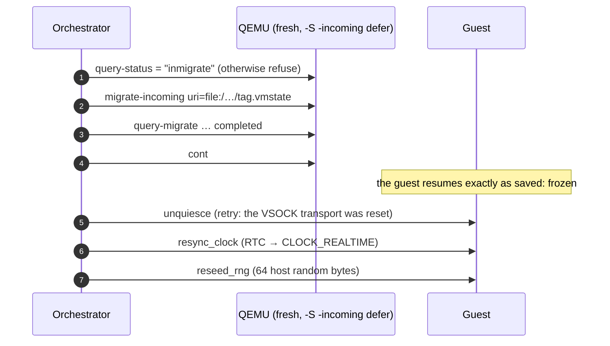

# Snapshots & QMP

`karim snapshot` saves and restores the complete state of a running MicroVM — RAM, device state and vCPUs — through the QEMU Machine Protocol. The orchestrator (`internal/snapshot`) runs every operation as a **saga**: each step that changes the guest or the VM has a compensating step that always runs.

## Why `savevm` could not work

Internal snapshots (`savevm`) store VM state inside a qcow2 image's snapshot table. QEMU needs at least one writable, snapshot-capable block device, and every writable device must support snapshots. The MicroVM's only disk is a **raw, read-only** SquashFS image, so the operation can never succeed.

The old client also drove `savevm` through HMP (`human-monitor-command`). QMP reports success as long as the text command was *dispatched*; the HMP error comes back as ordinary output. Every snapshot therefore "succeeded". Karim now uses native QMP only.

## Two models

| | `file` (default) | `internal` |
|---|---|---|
| Where state lives | `dist/snapshots/<tag>.vmstate` + `<tag>.json` | qcow2 internal snapshot on a state node |
| Mechanism | QMP `migrate` to `file:` | job-based `snapshot-save` / `snapshot-load` / `snapshot-delete` (QEMU ≥ 6.0, checked on save) |
| Rootfs | stays raw read-only | stays raw read-only |
| Restore | fresh QEMU started with `-incoming defer` | in place |
| Boot | `make run` | `make run SNAPSHOT_MODEL=internal`, plus `--model internal` (or `KARIM_SNAPSHOT_MODEL=internal`) on every CLI call |

For the internal model the Makefile attaches a qcow2 image as a named block node that **no guest device uses**:

```bash
-blockdev driver=file,filename=dist/snapstate.qcow2,node-name=snapstate-file \
-blockdev driver=qcow2,file=snapstate-file,node-name=snapstate
```

The orchestrator checks preconditions with `query-named-block-nodes` before touching the guest, and refuses with an actionable error when no writable qcow2 node exists.

## The save saga



Failures report what was and was not undone as warnings, for example `guest not quiesced (…); the snapshot is crash-consistent only`. One warning is misleading: the thaw compensation always says `snapshot saved, but guest thaw failed: …`, even when the save itself failed. This is a known defect in the message. A save with an unwritable destination fails at `migrate` with QEMU's error (`Unable to open …: Is a directory`), resumes the VM, thaws the guest and writes no metadata.

<Callout type="note" title="What quiesce freezes in the default layout">
`FIFREEZE` applies only to writable, block-backed filesystems. squashfs, tmpfs and overlay are skipped, and so is anything that answers `EOPNOTSUPP`, `ENOTTY` or `EINVAL`. The default MicroVM has no writable block device (see [Runtime Storage](/subsystems/runtime-storage)), so quiesce is effectively `sync()` and the report says so.
</Callout>

### Transport choices

- `file:` URIs need QEMU ≥ 8.2; older versions stream through `exec:cat > <path>`.
- The `mapped-ram` capability is used when QEMU ≥ 9.0 offers it and recorded in the metadata, because the restoring QEMU must enable it too.
- QEMU 8.2 emits no `MIGRATION` events unless the `events` capability is enabled, so completion is detected by polling `query-migrate`. Events are still consumed when present.

## The restore saga



`make run-restore SNAPSHOT=<tag>` starts QEMU paused in incoming mode and runs `karim snapshot restore <tag> --wait-qmp 30s` in the background.

## Entropy after restore

Restoring the same snapshot twice would replay identical CSPRNG state in both copies. Two mechanisms prevent that:

1. **vmgenid.** QEMU runs with `-device vmgenid,id=vmgenid0` (`guid=auto`) and the guest kernel has `CONFIG_VMGENID`. A restore into a *fresh* QEMU process exposes a new generation ID after the incoming migration, and the guest driver reseeds.
2. **Explicit reseed & RTC sync.** An *in-place* restore keeps the process's generation ID. After every restore, `Unquiesce()` invokes `system.ReseedEntropy()` to inject fresh bytes into `/dev/urandom` (crediting entropy and invalidating cached nonces) and `system.SyncRTCTime()` to resynchronize `CLOCK_REALTIME` from hardware RTC `/dev/rtc0`.

## The QMP client

- A single reader goroutine demultiplexes responses, matched by the QMP `id` member (FIFO fallback for servers that do not echo it), from asynchronous events, which go to subscribers.
- Every command has a context deadline; a lost connection fails all pending commands.
- `RunJob` subscribes to `JOB_STATUS_CHANGE`, waits for `concluded` (with a polling safety net), surfaces the job's structured `error`, and dismisses the job.
- Tags are validated (`^[A-Za-z0-9][A-Za-z0-9._-]{0,63}$`, and no `..`) because they become file names and QMP arguments.
- Timeouts: 10 min per operation and 60 s per QMP command. After a restore the thaw is retried for 20 s, and the clock resync and RNG reseed for 5 s each. The thaw after a save has 10 s.
- `reseed_rng` accepts 32–512 bytes and credits `len × 8` bits.
- If QEMU offers `mapped-ram` but is older than 9.0, the capability is explicitly disabled.

## Contract testing

Tests used to validate a hand-written mock that encoded wrong assumptions. Now:

```bash
# Real QEMU (TCG, no KVM needed); records every QMP conversation
KARIM_QEMU_CONTRACT=1 KARIM_QMP_RECORD=testdata/qemu-8.2 go test -run Contract ./internal/snapshot/
```

The recorded transcripts are replayed by `qmptest.ReplayServer`. The replayer resynchronizes on repeated polls, and the unit tests **fail** on any command a real QEMU conversation did not contain. `make test-phase8` replays the same transcripts through `testing/mock_qmp_server.go`, which answers an unexpected command with a `GenericError` but does not fail the run.

<Callout type="success" title="Verified end to end">
A running MicroVM was snapshotted (154 MB of state in 1.5 s, VM resumed), powered off, and restored into a fresh QEMU. The restored guest answered over VSOCK, was thawed, had its clock resynced and RNG reseeded, and still ran its services.
</Callout>
