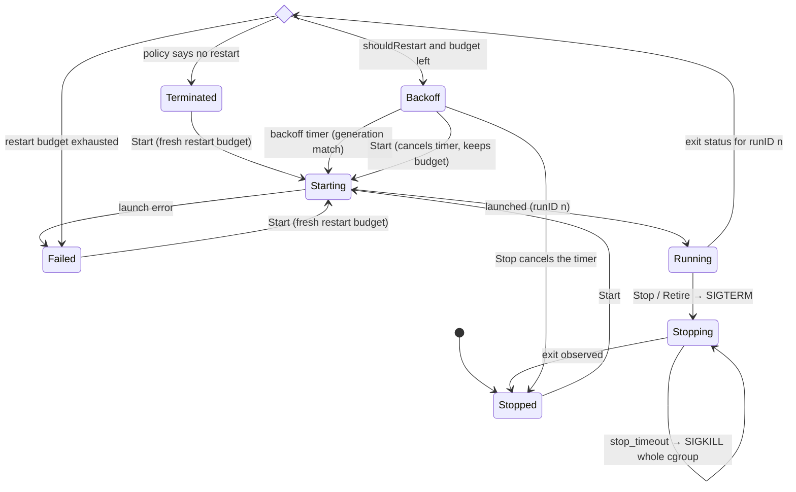
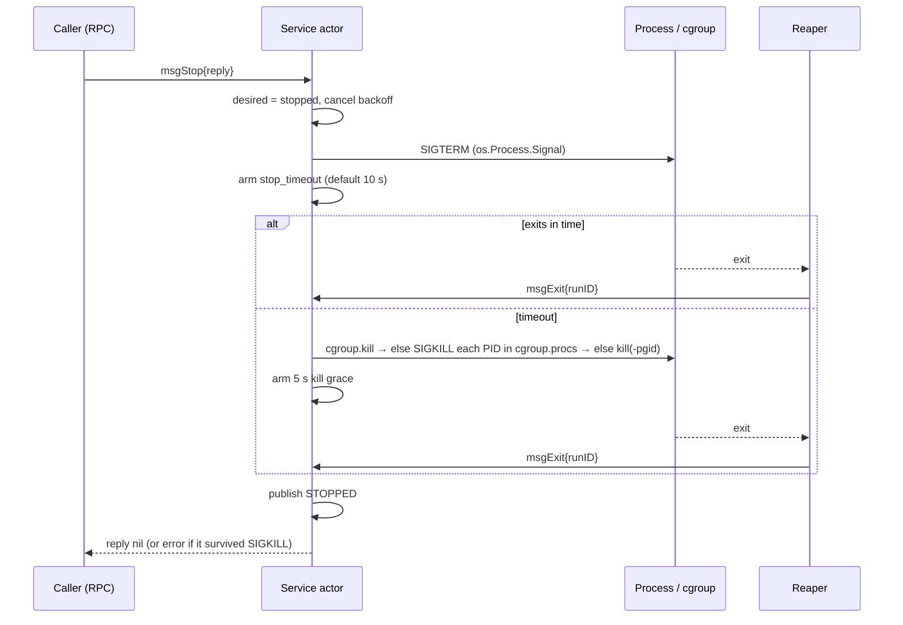

# Supervisor Internals

`karim-svcd` supervises every guest service. Its design rests on two rules that remove whole classes of race conditions:

- **Exactly one component consumes child exit statuses** — the *Reaper*.
- **Exactly one goroutine owns each service's state** — its *actor*.

Everything else (the registry, the control plane, shutdown) talks to services by message passing and reads immutable snapshots.

<Callout type="note" title="Source">
`internal/svcd/reaper.go`, `service.go`, `supervisor.go`, `launcher.go`, `cgroup.go`. Background on why this design exists: [PM-001](/postmortems/pm-001-reaper-race).
</Callout>

## The centralized reaper

A zombie can be reaped exactly once. If two parties wait — say a PID-1 loop calling `wait4(-1)` and `exec.Cmd.Wait` inside a service monitor — one of them inevitably receives `ECHILD` and has to guess. Karim therefore has a single reaper per process, and code linked into the supervisor must never call `Cmd.Wait`, `Cmd.Run`, `Cmd.Output` or `Process.Wait`.

### Peek, attribute, reap

Each wakeup loops over three steps:

1. **Peek** with `waitid(P_ALL, 0, &info, WEXITED | WNOHANG | WNOWAIT)`. `WNOWAIT` leaves the child a zombie, so its PID stays pinned: it cannot be recycled by a new process while we look it up.
2. **Attribute** the PID to its owner in the registry, under the same mutex `Spawn` holds.
3. **Reap** that exact PID with `wait4(pid)` and deliver a structured `ExitStatus` to the owner.

```go title="internal/svcd/reaper.go" {3-5,10-14}
func (r *Reaper) ReapNow() {
	for {
		pid, err := peekExited()     // waitid(P_ALL, WEXITED|WNOHANG|WNOWAIT)
		if err != nil || pid <= 0 {
			return // ECHILD: no children at all; 0: none has exited yet
		}

		r.mu.Lock()
		owner := r.owners[pid]
		delete(r.owners, pid)
		var ws unix.WaitStatus
		_, werr := unix.Wait4(pid, &ws, 0, nil) // the zombie exists: returns at once
		r.mu.Unlock()
		// ... dispatch exitStatusFromWait(pid, ws) to owner, or log an orphan
	}
}
```

`golang.org/x/sys/unix` hides the `siginfo_t` union, so the reaper declares the 128-byte SIGCHLD layout itself and issues the raw syscall:

```go title="internal/svcd/reaper.go"
type sigchldInfo struct {
	Signo  int32
	Errno  int32
	Code   int32
	_      int32
	Pid    int32   // si_pid at offset 16
	Uid    uint32
	Status int32
	_      [100]byte
}
```

### Registration without a window

A child can exit before `cmd.Start()` even returns. `Spawn` therefore holds the reaper's mutex across `Start` *and* the registration; a racing reap blocks on that mutex and finds the owner once it is recorded.

```go title="internal/svcd/reaper.go"
func (r *Reaper) Spawn(cmd *exec.Cmd, onExit func(ExitStatus)) error {
	if !r.running.Load() {
		return ErrReaperNotRunning // nobody would ever reap this child
	}
	r.mu.Lock()
	defer r.mu.Unlock()
	if err := cmd.Start(); err != nil {
		return err
	}
	r.owners[cmd.Process.Pid] = onExit
	return nil
}
```

### Wakeups

The reaper wakes on `SIGCHLD` **and** on a 2-second sweep: SIGCHLD deliveries coalesce, and a missed signal must not leave zombies behind. Children without an owner — orphans reparented to the supervisor, which is a child subreaper — are reaped and logged.

## Service actors

Each `ManagedService` runs one goroutine that processes a mailbox in order. Commands carry a reply channel; events come from the reaper and from timers.

| Message | Sender | Meaning |
|---|---|---|
| `msgStart{reply}` | registry / RPC | launch if not running |
| `msgStop{reply}` | registry / RPC | set desired = stopped, SIGTERM, wait for exit |
| `msgRetire{reply}` | replace / shutdown | stop, then terminate the actor |
| `msgFail{reason}` | boot planner | mark FAILED (e.g. dependency cycle) |
| `msgExit{runID, status}` | reaper | a run ended |
| `msgBackoffFired{gen}` | timer | restart now, if still wanted |
| `msgStopTimeout{runID, phase}` | timer | escalate to SIGKILL, then give up |

### Runs, not sticky flags

Every launch creates a `run` with a fresh `runID`. The exit callback captures that ID, so an event for an older incarnation is recognized and dropped instead of being attributed to the current one — the "sticky exit code" failure mode cannot occur by construction.

```go title="internal/svcd/service.go"
func (ms *ManagedService) onExit(runID uint64, st ExitStatus) {
	if ms.cur == nil || ms.cur.id != runID {
		return // status for an incarnation that is no longer current
	}
	// ...
}
```

### Desired state vs observed state

Operator intent (`desiredRunning`) is separate from what the process did. The restart decision is a pure function:

```go title="internal/svcd/service.go"
func shouldRestart(desiredRunning bool, policy string, cls exitClass) bool {
	if !desiredRunning || cls == exitStopped {
		return false
	}
	switch policy {
	case "always":
		return true
	case "on-failure":
		return cls == exitFailure
	default:
		return false
	}
}
```

`exitStopped` means "terminated because we asked it to" — a SIGTERM exit during a stop is never counted as a failure, so `karim stop` is never undone by `restart = "always"`.

### Replies after publication

Readers never lock a service: after every message the actor publishes an immutable `ServiceSnapshot` through an `atomic.Pointer`. Replies to `Start`/`Stop` are queued and sent only *after* that publication, so a caller whose `Stop()` returned always observes `STOPPED`.

## Service lifecycle



*Exited* is the transient decision point when the reaper delivers a status; it is never published as a state.

## Restart policy

| Parameter | Default | Behavior |
|---|---|---|
| Backoff | 1 s, doubling | capped at 30 s; reset to 1 s after a run of ≥ 10 s |
| `max_restarts` | 0 (unlimited) | restarts allowed inside the sliding window |
| `restart_window` | 5 m | older restarts age out of the budget |
| Launch failure | — | on an operator or boot `Start`: `FAILED` at once, no retry. During an automatic restart: counts as a failed run and goes through backoff and budget |

A manual `karim start` after `TERMINATED` or `FAILED` begins a fresh budget.

## Stopping a service



Where the kernel supports it, every service is cloned **directly into its cgroup** (`clone3(CLONE_INTO_CGROUP)` via `SysProcAttr.UseCgroupFD`). `cgroup.kill` then reaches every descendant, and no early fork can escape. Each new run starts in an empty cgroup, because leftovers from a previous run are killed first.

The fallbacks are weaker:

- **`clone3` into the cgroup fails.** The child starts outside it and is moved in with `AttachProcess`. A fork made in that short window stays outside the cgroup.
- **The cgroup cannot be created.** The service runs **without limits**, protected only by its process group and `Pdeathsig = SIGKILL`.
- **Writing `cgroup.kill` fails.** Each PID listed in `cgroup.procs` gets `SIGKILL`.
- **No cgroup manager.** The kill goes to the process group (`kill(-pgid)`).

## Launching

`ExecLauncher` builds the command and never waits on it:

- **Pipes are owned by the supervisor.** The write ends go to the child and the parent's copies are closed immediately, so the log drainers end on EOF when every writer has exited — the final lines of a crashing service are never lost. Output is echoed to the console and kept in a 500-line ring (`karim logs`).
- **Identity.** `user` / `group` become a `syscall.Credential` with an empty supplementary-group list.
- **Process group.** `Setpgid` isolates services from console job control and gives a fallback kill target.
- **Isolation wrapper.** The service is exec'd through `karim-secd` (see [Security](/subsystems/security)), with two exceptions:
  - The profile is `unrestricted`, `none` or `disabled`. This is an exact, case-sensitive match.
  - No secd binary is found at `/sbin/karim-secd` or `build/karim-secd`. The service then runs unwrapped **without a warning**.
- **Pre-flight.** The launcher checks that the executable exists and falls back to `build/<basename>` for host-side runs. The default environment is `PATH`, `LD_LIBRARY_PATH`, `HOME` (from `/etc/passwd`) and `TMPDIR`, plus the service's `[env]`.
- **Chroot.** `root_dir` (also `rootdir` or `chroot`) sets `SysProcAttr.Chroot`. The secd path is looked up on the host but exec'd inside the new root, so a chroot without its own `/sbin/karim-secd` fails to start.

## Registry and rolling updates

`Supervisor` keeps the service map as an unexported field, and every access goes through methods that take the registry lock. That lock is **never held across a blocking call**. A separate `replaceMu` serializes replacements. `Replace` (used by `karim apply` / `karim run`) retires the old instance and waits for its exit before registering and starting the new one, so a replaced service can never keep running outside the registry.

Boot planning is fail-operational. `Plan` resolves a partial order. Services in or behind a dependency cycle, or with an invalid name, are marked `FAILED` with the reason, and everything else still starts. Invalid TOML files are reported and skipped.

`after` only orders the **start calls**. `StartPlanned` staggers them by 100 ms but does not wait for a dependency to reach `RUNNING`, and a dependency that fails does not stop its dependents. An `after` entry that names a service that does not exist is ignored.

If no service can be started at all, the supervisor spawns `/bin/sh` on the console (`-emergency-shell`, on by default) instead of leaving an unreachable system. At shutdown, `StopAll` has a 60 s deadline; services still running after it are force-killed.

## Verification

- Deterministic state-machine tests with an injected fake launcher and fake clock: instant exits, stale events, stop during backoff, escalation, budget windows, replace during restart.
- Real-process tests against the reaper (exit codes, signals, orphans, log capture), repeated under `-race`.
- End-to-end in a KVM MicroVM: a stopped `restart = "always"` service stays stopped; `sample_app` exits 0 and stays `TERMINATED`.
